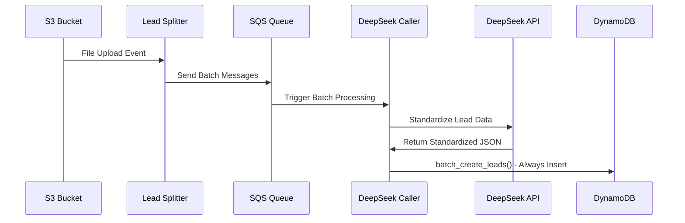
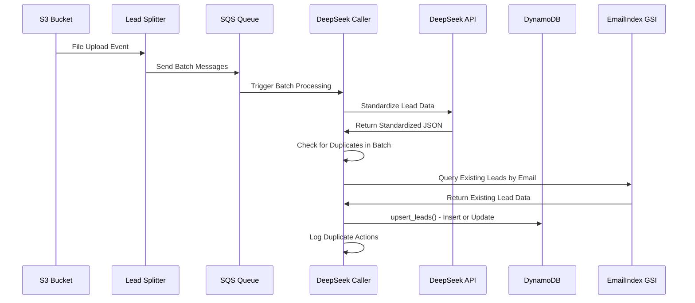

# Design Document

## Overview

The Duplicate Lead Handling feature extends the existing Easy CRM lead management system to detect and handle duplicate entries based on email addresses. When duplicate leads are detected during batch processing, the system will automatically overwrite existing entries with the latest data, ensuring the database always contains the most current information for each contact.

This design integrates seamlessly with the existing batch processing architecture, utilizing the current EmailIndex GSI for efficient duplicate detection and maintaining the performance characteristics of the existing system.

## Architecture

### Current System Flow (Before)


### Enhanced System Flow (After)


## Components and Interfaces

### Enhanced DynamoDB Utils

**New Methods:**

#### `find_lead_by_email(email: str) -> Optional[Dict[str, Any]]`
```python
def find_lead_by_email(self, email: str) -> Optional[Dict[str, Any]]:
    """
    Find existing lead by email address using EmailIndex GSI.
    
    Args:
        email: Email address to search for (case-insensitive)
        
    Returns:
        Optional[Dict]: Existing lead data or None if not found
    """
```

#### `upsert_lead(lead_data: Dict[str, Any], source_file: str) -> Tuple[str, bool]`
```python
def upsert_lead(self, lead_data: Dict[str, Any], source_file: str) -> Tuple[str, bool]:
    """
    Insert new lead or update existing lead based on email.
    
    Args:
        lead_data: Lead information including email
        source_file: Source filename for tracking
        
    Returns:
        Tuple[str, bool]: (leadId, was_updated)
            - leadId: The lead ID (existing or new)
            - was_updated: True if existing lead was updated, False if new lead created
    """
```

#### `batch_upsert_leads(leads_data: List[Dict[str, Any]], source_file: str) -> Dict[str, Any]`
```python
def batch_upsert_leads(self, leads_data: List[Dict[str, Any]], source_file: str) -> Dict[str, Any]:
    """
    Batch upsert multiple leads with duplicate detection.
    
    Args:
        leads_data: List of lead dictionaries
        source_file: Source filename for tracking
        
    Returns:
        Dict containing:
            - created_leads: List of new lead IDs
            - updated_leads: List of updated lead IDs  
            - duplicate_actions: List of duplicate handling logs
            - processing_stats: Performance metrics
    """
```

### Email Normalization Utility

**New Utility Class:**

```python
class EmailNormalizer:
    """Utility for email address normalization and validation."""
    
    @staticmethod
    def normalize_email(email: str) -> str:
        """
        Normalize email address for consistent duplicate detection.
        
        Args:
            email: Raw email address
            
        Returns:
            str: Normalized email (lowercase, trimmed)
        """
        if not email or email.strip().lower() in ['', 'n/a', 'null', 'none']:
            return 'N/A'
        
        return email.strip().lower()
    
    @staticmethod
    def is_valid_email_format(email: str) -> bool:
        """
        Basic email format validation.
        
        Args:
            email: Email address to validate
            
        Returns:
            bool: True if email format appears valid
        """
        import re
        pattern = r'^[a-zA-Z0-9._%+-]+@[a-zA-Z0-9.-]+\.[a-zA-Z]{2,}$'
        return bool(re.match(pattern, email))
```

### Enhanced DeepSeek Caller Function

**Modified Processing Logic:**

```python
def process_batch_with_duplicate_handling(batch_data: Dict[str, Any]) -> Dict[str, Any]:
    """
    Enhanced batch processing with duplicate detection and handling.
    
    Processing Steps:
    1. Standardize leads with DeepSeek (existing logic)
    2. Normalize email addresses in standardized data
    3. Detect duplicates within the batch (same email multiple times)
    4. Query existing leads by email using EmailIndex GSI
    5. Perform upsert operations (insert new or update existing)
    6. Log duplicate actions and generate processing statistics
    
    Returns:
        Enhanced processing result with duplicate handling metrics
    """
```

**Duplicate Detection Logic:**

```python
def detect_and_resolve_duplicates(standardized_leads: List[Dict[str, Any]]) -> Tuple[List[Dict[str, Any]], List[Dict[str, Any]]]:
    """
    Detect duplicates within batch and resolve conflicts.
    
    Args:
        standardized_leads: List of standardized lead data from DeepSeek
        
    Returns:
        Tuple containing:
            - unique_leads: List of leads with duplicates resolved (last occurrence wins)
            - duplicate_logs: List of duplicate resolution actions for logging
    """
    email_to_lead = {}
    duplicate_logs = []
    
    for i, lead in enumerate(standardized_leads):
        email = EmailNormalizer.normalize_email(lead.get('email', ''))
        
        if email == 'N/A':
            # Always treat empty emails as unique
            lead['_batch_index'] = i
            email_to_lead[f"no_email_{i}"] = lead
        else:
            if email in email_to_lead:
                # Duplicate found within batch
                duplicate_logs.append({
                    'action': 'batch_duplicate_resolved',
                    'email': email,
                    'previous_index': email_to_lead[email]['_batch_index'],
                    'current_index': i,
                    'resolution': 'last_occurrence_wins'
                })
            
            lead['_batch_index'] = i
            email_to_lead[email] = lead
    
    unique_leads = [lead for lead in email_to_lead.values() if not lead.get('email', '').startswith('no_email_')]
    return unique_leads, duplicate_logs
```

## Data Models

### Enhanced DynamoDB Operations

**EmailIndex GSI Usage:**
- **Partition Key**: `email` (String)
- **Query Pattern**: `email = :email_value`
- **Use Case**: Efficient lookup of existing leads by email address

**Updated Lead Item Structure:**
```json
{
  "leadId": "uuid-v4",           // Preserved for existing leads
  "firstName": "John",
  "lastName": "Doe", 
  "title": "Software Engineer",
  "company": "Tech Corp",
  "email": "john.doe@techcorp.com",  // Normalized for duplicate detection
  "phone": "+1-555-123-4567",
  "remarks": "Additional notes",
  "sourceFile": "latest-upload.csv",  // Updated to latest source
  "createdAt": "2025-01-15T10:00:00Z",  // Preserved from original
  "updatedAt": "2025-01-20T14:30:00Z"   // Updated on each modification
}
```

### Duplicate Action Logging

**Log Entry Structure:**
```json
{
  "timestamp": "2025-01-20T14:30:00Z",
  "action": "lead_updated",
  "email": "john.doe@techcorp.com",
  "leadId": "existing-uuid",
  "previousSourceFile": "old-upload.csv",
  "newSourceFile": "new-upload.csv",
  "fieldsChanged": ["title", "company", "phone"],
  "batchId": "batch-uuid"
}
```

## Error Handling

### Duplicate Detection Errors

**EmailIndex GSI Unavailable:**
```python
try:
    existing_lead = db_utils.find_lead_by_email(normalized_email)
except ClientError as e:
    if e.response['Error']['Code'] == 'ResourceNotFoundException':
        logger.warning(f"EmailIndex GSI not available, falling back to create new lead")
        existing_lead = None
    else:
        raise DatabaseError(f"Failed to query EmailIndex: {str(e)}")
```

**Batch Processing Errors:**
- **Individual Lead Failures**: Continue processing other leads in batch
- **Duplicate Detection Timeout**: Fall back to creating new leads
- **DynamoDB Throttling**: Implement exponential backoff with retry

**Error Recovery Strategies:**
1. **GSI Query Failure**: Fall back to creating new leads (no duplicates detected)
2. **Update Operation Failure**: Retry with exponential backoff, then create new lead
3. **Batch Processing Timeout**: Process remaining leads individually
4. **Memory Constraints**: Process smaller sub-batches

### Logging and Monitoring

**CloudWatch Metrics:**
- `DuplicateLeadsDetected`: Count of duplicates found per batch
- `LeadsUpdated`: Count of existing leads updated
- `LeadsCreated`: Count of new leads created
- `DuplicateDetectionLatency`: Time spent on duplicate detection
- `EmailIndexQueryErrors`: Count of GSI query failures

**Structured Logging:**
```python
logger.info(json.dumps({
    'event': 'duplicate_handling_summary',
    'batch_id': batch_id,
    'total_leads': len(standardized_leads),
    'duplicates_detected': len(duplicate_actions),
    'leads_updated': updated_count,
    'leads_created': created_count,
    'processing_time_ms': processing_time,
    'email_index_queries': query_count
}))
```

## Testing Strategy

### Unit Testing

**Email Normalization Tests:**
```python
def test_email_normalization():
    assert EmailNormalizer.normalize_email("  John.Doe@EXAMPLE.COM  ") == "john.doe@example.com"
    assert EmailNormalizer.normalize_email("") == "N/A"
    assert EmailNormalizer.normalize_email("N/A") == "N/A"
    assert EmailNormalizer.normalize_email(None) == "N/A"
```

**Duplicate Detection Tests:**
```python
def test_batch_duplicate_detection():
    leads = [
        {"email": "john@example.com", "firstName": "John", "lastName": "Doe"},
        {"email": "jane@example.com", "firstName": "Jane", "lastName": "Smith"},
        {"email": "JOHN@EXAMPLE.COM", "firstName": "John", "lastName": "Updated"}  # Duplicate
    ]
    
    unique_leads, duplicate_logs = detect_and_resolve_duplicates(leads)
    
    assert len(unique_leads) == 2
    assert len(duplicate_logs) == 1
    assert unique_leads[0]["lastName"] == "Updated"  # Last occurrence wins
```

**DynamoDB Upsert Tests:**
```python
@mock_dynamodb
def test_upsert_new_lead():
    db_utils = DynamoDBUtils('test-table')
    lead_data = {"email": "new@example.com", "firstName": "New", "lastName": "User"}
    
    lead_id, was_updated = db_utils.upsert_lead(lead_data, "test.csv")
    
    assert was_updated == False  # New lead created
    assert lead_id is not None

@mock_dynamodb  
def test_upsert_existing_lead():
    db_utils = DynamoDBUtils('test-table')
    
    # Create existing lead
    existing_lead = {"email": "existing@example.com", "firstName": "Old", "lastName": "Name"}
    original_id, _ = db_utils.upsert_lead(existing_lead, "old.csv")
    
    # Update with new data
    updated_lead = {"email": "existing@example.com", "firstName": "New", "lastName": "Name"}
    updated_id, was_updated = db_utils.upsert_lead(updated_lead, "new.csv")
    
    assert was_updated == True  # Existing lead updated
    assert updated_id == original_id  # Same lead ID preserved
```

### Integration Testing

**End-to-End Duplicate Handling:**
```python
def test_e2e_duplicate_handling():
    # Upload file with duplicate emails
    # Verify first upload creates new leads
    # Upload second file with same emails but different data
    # Verify leads are updated, not duplicated
    # Check that updatedAt timestamps are current
    # Verify sourceFile reflects latest upload
```

**Performance Testing:**
```python
def test_duplicate_detection_performance():
    # Test with batch containing 50% duplicates
    # Measure processing time increase
    # Verify it's within 20% of baseline
    # Test EmailIndex query performance
```

### Edge Case Testing

**Email Variations:**
- Case sensitivity: `john@example.com` vs `JOHN@EXAMPLE.COM`
- Whitespace: `  john@example.com  ` vs `john@example.com`
- Empty emails: `""`, `"N/A"`, `null`, `undefined`
- Invalid formats: `"not-an-email"`, `"@example.com"`, `"john@"`

**Batch Scenarios:**
- Multiple duplicates in same batch
- Batch with all duplicates
- Batch with no duplicates
- Mixed valid/invalid email formats

## Performance Considerations

### EmailIndex GSI Optimization

**Query Efficiency:**
- Single item queries by email: ~1-5ms latency
- Batch processing impact: +10-20% processing time
- Memory usage: Minimal additional overhead

**Scaling Considerations:**
- EmailIndex automatically scales with table
- No additional capacity planning required
- Query costs: ~$0.25 per million queries

### Batch Processing Impact

**Processing Time Analysis:**
- Baseline batch processing: ~2-5 seconds per 10-lead batch
- With duplicate detection: ~2.5-6 seconds per 10-lead batch
- Additional overhead: 10-20% increase in processing time

**Memory Usage:**
- Additional memory for duplicate tracking: ~1KB per batch
- EmailIndex query results: ~1KB per existing lead found
- Total memory impact: <5% increase

### Optimization Strategies

**Batch-Level Optimizations:**
1. **Batch Email Queries**: Query multiple emails in single DynamoDB operation where possible
2. **In-Memory Deduplication**: Resolve duplicates within batch before querying DynamoDB
3. **Parallel Processing**: Process duplicate detection and DeepSeek calls concurrently

**Caching Strategy:**
```python
class EmailCache:
    """In-memory cache for recently queried emails within Lambda execution."""
    
    def __init__(self, ttl_seconds: int = 300):
        self.cache = {}
        self.ttl = ttl_seconds
    
    def get_lead_by_email(self, email: str) -> Optional[Dict[str, Any]]:
        """Get cached lead data by email."""
        
    def cache_lead(self, email: str, lead_data: Optional[Dict[str, Any]]):
        """Cache lead data for email."""
```

## Security Considerations

### Data Privacy

**Email Handling:**
- Email addresses are normalized but not encrypted
- No additional PII exposure beyond current system
- Duplicate detection logs contain email addresses (consider data retention policies)

**Access Control:**
- No changes to existing IAM permissions required
- EmailIndex GSI uses same access controls as main table
- Duplicate handling logs use existing CloudWatch permissions

### Audit Trail

**Duplicate Actions Logging:**
- All duplicate detection and update actions are logged
- Logs include timestamps, email addresses, and source files
- Maintains audit trail for compliance requirements

**Data Integrity:**
- Preserves original `createdAt` timestamps
- Updates `updatedAt` timestamps for tracking
- Maintains `sourceFile` history for data lineage

This design ensures that duplicate lead handling integrates seamlessly with the existing system while providing robust duplicate detection, efficient performance, and comprehensive logging for audit and monitoring purposes.