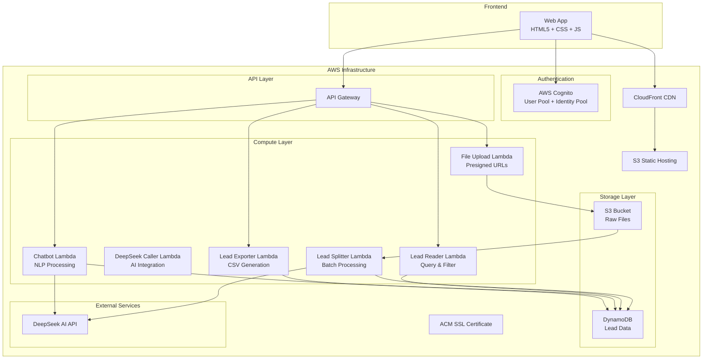

# Design Document

## Overview

The Lead Management System is a serverless web application built on AWS that enables users to upload CSV/Excel files containing lead data, automatically standardizes the format using DeepSeek AI, and provides a web interface for viewing, filtering, exporting, and querying leads through natural language chat.

The system follows a microservices architecture using AWS Lambda functions, with a React-based frontend hosted on S3/CloudFront, and DynamoDB for data storage.

## Architecture



## Components and Interfaces

### Frontend Web Application

**Technology Stack:**
- HTML5 for structure
- CSS with Tailwind for styling
- Vanilla JavaScript for functionality
- No framework dependencies to keep it simple

**Key Components:**
- **Upload Interface**: File drag-and-drop with progress indication
- **Leads Table**: Sortable, filterable data grid with pagination
- **Chat Interface**: Real-time chat widget for natural language queries
- **Export Controls**: Filter-aware CSV export functionality
- **Authentication**: Cognito-integrated login/logout

### API Gateway Configuration

**Endpoints:**
- `POST /upload` - Generate presigned S3 URLs
- `GET /leads` - Retrieve leads with pagination and filters
- `POST /export` - Generate filtered CSV exports
- `POST /chat` - Process natural language queries

**CORS Configuration:**
- Allow origins: CloudFront distribution domain
- Allow methods: GET, POST, OPTIONS
- Allow headers: Authorization, Content-Type

### Lambda Functions

#### 1. File Upload Function (`file-upload-lambda`)

**Runtime:** Python 3.13
**Memory:** 128 MB
**Timeout:** 30 seconds
**Purpose:** Generate presigned S3 URLs for secure file uploads

**Input:**
```json
{
  "fileName": "leads.csv",
  "fileType": "text/csv",
  "fileSize": 1024000
}
```

**Output:**
```json
{
  "uploadUrl": "https://s3.amazonaws.com/...",
  "fileKey": "uploads/uuid/leads.csv",
  "expiresIn": 3600
}
```

**Key Logic:**
- Validate file type (CSV/Excel only)
- Generate unique file key with UUID
- Create presigned URL with 1-hour expiration
- Return upload URL to client

#### 2. Lead Splitter Function (`lead-splitter-lambda`)

**Purpose:** Process uploaded files and create batches for DeepSeek processing

#### 3. DeepSeek Caller Function (`deepseek-caller-lambda`)

**Runtime:** Python 3.13
**Memory:** 512 MB
**Timeout:** 300 seconds (5 minutes)
**Purpose:** Process uploaded files and standardize lead data using DeepSeek AI

**Trigger:** S3 PUT event on uploads bucket
**Input:** S3 event notification

**Processing Flow:**
1. Download file from S3
2. Parse CSV/Excel content (all rows)
3. Send all data to DeepSeek AI for format recognition and standardization
4. DeepSeek returns complete lead data in standardized JSON format
5. Store all standardized leads in DynamoDB
6. Handle errors with single retry

**DeepSeek Integration:**
- Base URL: `https://api.deepseek.com`
- API Endpoint: `/v1/chat/completions`
- Model: `deepseek-chat`
- Input: Complete CSV/Excel data
- Output: Standardized JSON array with fields: firstName, lastName, title, company, email, phone, remarks

#### 3. Lead Reader Function (`lead-reader-lambda`)

**Runtime:** Python 3.13
**Memory:** 256 MB
**Timeout:** 30 seconds
**Purpose:** Handle lead retrieval with filtering, sorting, and pagination

**Input:**
```json
{
  "page": 1,
  "pageSize": 50,
  "filters": {
    "firstName": "John",
    "company": "Tech Corp",
    "phone": "+1-555-"
  },
  "sortBy": "lastName",
  "sortOrder": "asc"
}
```

**Output:**
```json
{
  "leads": [...],
  "totalCount": 150,
  "page": 1,
  "pageSize": 50,
  "totalPages": 3
}
```

#### 4. Lead Exporter Function (`lead-exporter-lambda`)

**Runtime:** Python 3.13
**Memory:** 256 MB
**Timeout:** 60 seconds
**Purpose:** Generate CSV exports with applied filters

**Input:**
```json
{
  "filters": {
    "firstName": "John",
    "company": "Tech Corp",
    "phone": "+1-555-"
  }
}
```

**Output:**
```json
{
  "message": "Successfully exported 25 leads",
  "leadCount": 25,
  "csvData": "base64-encoded-csv-content",
  "filename": "leads_export_20250909_143022.csv",
  "filters": {...}
}
```

**Processing:**
1. Receive filter parameters from frontend (same format as lead reader)
2. Apply identical filtering logic as lead reader function to ensure consistency
3. Retrieve all matching records without pagination (complete dataset)
4. Generate CSV with all standard fields: leadId, firstName, lastName, title, company, email, phone, remarks, sourceFile, createdAt, updatedAt
5. Return base64-encoded CSV data with timestamp-based filename
6. Handle empty result sets gracefully with appropriate messaging

**Key Design Principles:**
- **Filter Consistency**: Uses exact same filtering logic as lead reader to ensure exported data matches table display
- **Complete Export**: No pagination applied - exports all matching records
- **Standard Format**: Consistent CSV structure with all available fields
- **Error Handling**: Graceful handling of empty results and processing errors

#### 5. Chatbot Function (`chatbot-lambda`)

**Runtime:** Python 3.13
**Memory:** 256 MB
**Timeout:** 60 seconds
**Purpose:** Process natural language queries and return relevant lead data

**Input:**
```json
{
  "query": "Show me all leads from tech companies",
  "userId": "user123"
}
```

**Processing Flow:**
1. Send user query to DeepSeek AI
2. DeepSeek returns DynamoDB query structure
3. Execute query against DynamoDB
4. Format results for user-friendly response
5. Return structured answer

**Security Note:** Never send actual lead data to DeepSeek, only query structures and aggregated results.

## Data Models

### DynamoDB Table: `leads`

**Primary Key:** `leadId` (String) - UUID v4
**Attributes:**
- `firstName` (String) - Lead's first name or "N/A"
- `lastName` (String) - Lead's last name or "N/A"  
- `title` (String) - Job title or "N/A"
- `company` (String) - Company name or "N/A"
- `email` (String) - Email address or "N/A"
- `phone` (String) - Phone number or "N/A"
- `remarks` (String) - All additional data not fitting standard fields
- `createdAt` (String) - ISO timestamp
- `updatedAt` (String) - ISO timestamp
- `sourceFile` (String) - Original filename for tracking

**Global Secondary Indexes:**
1. **CompanyIndex**: `company` (Hash) + `createdAt` (Range)
2. **EmailIndex**: `email` (Hash) - for duplicate detection
3. **CreatedAtIndex**: `createdAt` (Hash) - for time-based queries

**Capacity Planning:**
- On-demand billing mode for variable workloads
- Expected item size: ~1KB per lead
- Read/write patterns: Heavy read, moderate write

### S3 Bucket Structure

**Bucket:** `lead-management-files-{account-id}`
**Structure:**
```
uploads/
  {uuid}/
    original-filename.csv
processed/
  {uuid}/
    processed-data.json
```

**Lifecycle Policy:**
- Delete files older than 90 days from uploads/
- Keep processed/ indefinitely for audit trail

## Error Handling

### File Upload Errors
- **Invalid file type**: Return 400 with clear message
- **File too large**: Return 413 with size limits
- **S3 upload failure**: Return 500 with retry instruction

### DeepSeek API Errors
- **Rate limiting**: Implement exponential backoff
- **API failure**: Single retry, then mark file as failed
- **Invalid response**: Log error, use fallback parsing

### DynamoDB Errors
- **Throttling**: Implement exponential backoff
- **Item not found**: Return empty results gracefully
- **Validation errors**: Return 400 with field-specific messages

### Frontend Error Handling
- **Network errors**: Show retry button with user-friendly message
- **Authentication errors**: Redirect to login
- **Validation errors**: Highlight problematic fields

## Testing Strategy

### Development Environment Setup
- **Python Virtual Environment**: Create and use venv for all development
- **Dependencies**: Install all libraries in venv, never use global packages
- **Environment Commands**:
  ```bash
  python3 -m venv venv
  source venv/bin/activate  # On macOS/Linux
  pip install -r requirements.txt
  ```

### Unit Testing
- **Lambda Functions**: Test each function with mock AWS services
- **Data Processing**: Test CSV/Excel parsing with various formats
- **DeepSeek Integration**: Test with actual API calls using provided test file
- **DynamoDB Operations**: Use local DynamoDB for testing
- **Test File**: Use `easy-crm-test` file from repository for DeepSeek integration testing

### Integration Testing
- **End-to-end file processing**: Upload → Format → Store → Retrieve
- **API Gateway integration**: Test all endpoints with authentication
- **S3 trigger testing**: Verify Lambda invocation on file upload
- **DeepSeek API Integration**: Test actual API calls with test data
- **Cross-service communication**: Test Lambda-to-Lambda interactions

### Performance Testing
- **File processing**: Test with large CSV files (10k+ rows)
- **Concurrent uploads**: Simulate multiple users uploading simultaneously
- **Database queries**: Test pagination and filtering performance
- **DeepSeek API**: Test rate limiting and response times with real API

### Security Testing
- **Authentication**: Verify Cognito integration and JWT validation
- **Authorization**: Test access controls for different user roles
- **Input validation**: Test malicious file uploads and SQL injection attempts
- **API security**: Verify CORS and request validation

### User Acceptance Testing
- **File format support**: Test various CSV/Excel formats including easy-crm-test
- **UI responsiveness**: Test on different devices and browsers
- **Chat functionality**: Test natural language query accuracy with DeepSeek
- **Export functionality**: Verify CSV output matches filtered data

## Deployment Strategy

### CloudFormation Infrastructure as Code
- **Main Template**: `infrastructure/main.yaml` - Root stack with all resources
- **Nested Templates**: Separate templates for different components
  - `infrastructure/cognito.yaml` - User pool and identity pool
  - `infrastructure/api-gateway.yaml` - API Gateway and endpoints
  - `infrastructure/lambda.yaml` - All Lambda functions and roles
  - `infrastructure/storage.yaml` - S3 buckets and DynamoDB table
  - `infrastructure/cloudfront.yaml` - CDN and SSL certificate

### Deployment Process
1. **Package Lambda Functions**: Zip Python code with dependencies
2. **Upload to S3**: Store deployment artifacts in deployment bucket
3. **Deploy CloudFormation**: Use AWS CLI with SSO profile `nch-prod`
4. **Configure Parameters**: Pass DeepSeek API key and other config via parameters
5. **Validate Deployment**: Run smoke tests against deployed endpoints

### Environment Configuration
- **Region**: ap-southeast-1 (Singapore)
- **Profile**: nch-prod (AWS SSO)
- **Parameters**: DeepSeek API key, domain names, certificate ARN
- **Outputs**: API Gateway URL, CloudFront distribution domain

## Security Considerations

### Authentication & Authorization
- AWS Cognito handles user authentication
- JWT tokens validate API requests
- IAM roles provide least-privilege access for Lambda functions

### Data Protection
- All data encrypted in transit (HTTPS/TLS)
- DynamoDB encryption at rest enabled
- S3 bucket encryption enabled
- No sensitive data sent to external APIs (DeepSeek)

### API Security
- API Gateway throttling enabled
- Request validation and sanitization
- CORS properly configured
- Rate limiting per user

### Infrastructure Security
- Security groups restrict network access
- CloudTrail logging enabled for audit
- Regular security updates for Lambda runtimes