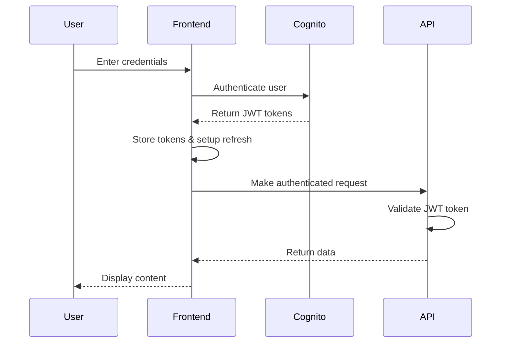

# Authentication Implementation Guide

## Overview

The Easy CRM application uses AWS Cognito for user authentication and authorization. This document describes the complete authentication implementation including login/logout functionality, JWT token handling, authentication guards, session management, and automatic token refresh.

## Architecture

### Components

1. **AWS Cognito User Pool**: Manages user accounts and authentication
2. **AWS Cognito Identity Pool**: Provides AWS credentials for authenticated users
3. **Frontend Authentication Module** (`frontend/js/auth.js`): Handles all client-side authentication logic
4. **API Authentication Guards** (`frontend/js/api.js`): Protects API calls with authentication checks
5. **Session Management**: Automatic token refresh and session persistence

### Authentication Flow



## Implementation Details

### 1. Cognito SDK Configuration

The application loads the AWS Cognito SDK dynamically and initializes the authentication module:

```javascript
// Cognito SDK is loaded in app.js
const cognitoScript = document.createElement('script');
cognitoScript.src = 'https://sdk.amazonaws.com/js/aws-cognito-sdk.min.js';

// Configuration in config.js
window.EasyCRM.Config.COGNITO = {
    USER_POOL_ID: 'ap-southeast-1_XXXXXXXXX',
    CLIENT_ID: 'your-cognito-client-id',
    REGION: 'ap-southeast-1'
};
```

### 2. Login/Logout Functionality

#### Login Process

1. User enters credentials in the login form
2. Frontend validates input and calls Cognito authentication
3. On success, JWT tokens are stored and automatic refresh is set up
4. User is redirected to the main application

```javascript
// Key methods in auth.js
handleLogin: function() {
    // Validates credentials with Cognito
    // Stores JWT tokens
    // Sets up automatic token refresh
    // Redirects to main app
}
```

#### Logout Process

1. User clicks logout button
2. Cognito session is terminated
3. Local tokens and user data are cleared
4. Token refresh interval is cleared
5. User is redirected to login screen

```javascript
logout: function() {
    // Clear token refresh interval
    // Sign out from Cognito
    // Clear user data from localStorage
    // Redirect to login
}
```

### 3. JWT Token Handling

#### Token Storage

- **ID Token**: Used for API authentication
- **Access Token**: Used for AWS service access
- **Refresh Token**: Used to obtain new tokens

#### Token Validation

```javascript
isTokenExpiring: function() {
    // Decodes JWT token
    // Checks expiration time
    // Returns true if token expires within 5 minutes
}
```

#### Automatic Token Refresh

```javascript
setupTokenRefresh: function() {
    // Sets up interval to check token expiration every minute
    // Automatically refreshes tokens when needed
}

ensureValidToken: function() {
    // Checks if current token is valid
    // Refreshes token if expiring
    // Returns promise with valid token
}
```

### 4. Authentication Guards

All API calls are protected with authentication guards:

```javascript
// In api.js
request: async function(endpoint, options = {}) {
    // Ensure valid token before making request
    let token = await auth.ensureValidToken();
    
    // Add Authorization header
    headers: {
        'Authorization': `Bearer ${token}`
    }
    
    // Handle 401/403 responses by logging out user
}

// Authentication guard for specific endpoints
requireAuth: function() {
    if (!this.isAuthenticated()) {
        throw new Error('Authentication required');
    }
}
```

### 5. Session Management

#### Session Persistence

- Authentication state is checked on page load
- Cognito session is validated using stored tokens
- Invalid sessions redirect to login

#### Session Cleanup

```javascript
clearUserData: function() {
    // Removes user-specific data from localStorage
    // Clears Cognito-related cached data
    // Preserves non-user application data
}
```

#### Automatic Session Management

- Token refresh runs every minute when authenticated
- Expired sessions automatically redirect to login
- Network errors are handled gracefully

## Configuration

### CloudFormation Template

The Cognito resources are defined in `infrastructure/cognito.yaml`:

```yaml
# User Pool with email verification
UserPool:
  Type: AWS::Cognito::UserPool
  Properties:
    UserPoolName: !Sub 'easy-crm-users-${Environment}'
    AliasAttributes: [email]
    AutoVerifiedAttributes: [email]

# User Pool Client for web application
UserPoolClient:
  Type: AWS::Cognito::UserPoolClient
  Properties:
    ExplicitAuthFlows:
      - ALLOW_USER_SRP_AUTH
      - ALLOW_REFRESH_TOKEN_AUTH
      - ALLOW_USER_PASSWORD_AUTH
```

### Frontend Configuration

Configuration is loaded from `frontend/config.json`:

```json
{
  "cognito": {
    "userPoolId": "ap-southeast-1_XXXXXXXXX",
    "clientId": "your-cognito-client-id",
    "region": "ap-southeast-1"
  }
}
```

## Security Features

### Password Policy

- Minimum 8 characters
- Requires uppercase, lowercase, and numbers
- No symbols required for better usability

### Token Security

- JWT tokens are stored in memory (not localStorage)
- Automatic token refresh prevents long-lived tokens
- Tokens are cleared on logout and session expiry

### API Protection

- All API endpoints require valid JWT tokens
- 401/403 responses trigger automatic logout
- Request timeouts prevent hanging requests

### Input Validation

- Email format validation
- Password strength requirements
- XSS protection through HTML sanitization

## Testing

### Unit Tests

Run unit tests for authentication logic:

```bash
python tests/run_auth_tests.py --unit-only
```

Tests cover:
- Token expiration checking
- Session validation logic
- Form validation
- Error handling
- State management

### Integration Tests

Run integration tests for complete authentication flow:

```bash
python tests/run_auth_tests.py --integration-only
```

Tests cover:
- Login/logout workflow
- Token refresh functionality
- Authentication guards
- Session persistence
- Error scenarios

### Validation Tests

Run validation tests to check implementation completeness:

```bash
python tests/run_auth_tests.py --validate-only
```

## Troubleshooting

### Common Issues

1. **Cognito SDK not loading**
   - Check network connectivity
   - Verify CDN availability
   - Check browser console for errors

2. **Configuration not found**
   - Verify `config.json` exists and is valid
   - Check CloudFormation outputs
   - Ensure correct User Pool ID and Client ID

3. **Token refresh failures**
   - Check Cognito User Pool configuration
   - Verify refresh token validity period
   - Check network connectivity

4. **Authentication loops**
   - Clear browser cache and localStorage
   - Check for token expiration issues
   - Verify Cognito session state

### Debug Information

Access debug information in browser console:

```javascript
// Get application status
window.EasyCRM.debug.getStatus()

// Get authentication errors
window.EasyCRM.debug.getErrors()

// Reinitialize authentication
window.EasyCRM.debug.reinitialize()
```

## Best Practices

### Development

1. Always use HTTPS in production
2. Implement proper error handling
3. Use secure token storage (memory, not localStorage)
4. Implement automatic token refresh
5. Clear sensitive data on logout

### Production

1. Monitor authentication metrics
2. Set up proper logging
3. Implement rate limiting
4. Use strong password policies
5. Regular security audits

### User Experience

1. Provide clear error messages
2. Implement loading states
3. Handle network errors gracefully
4. Persist authentication state across page reloads
5. Provide easy logout functionality

## API Reference

### Authentication Module (`window.EasyCRM.Auth`)

#### Methods

- `init()`: Initialize authentication module
- `checkAuthState()`: Check current authentication state
- `handleLogin()`: Process login form submission
- `handleRegister()`: Process registration form submission
- `logout()`: Log out current user
- `getToken()`: Get current JWT token
- `refreshToken()`: Refresh expired token
- `isTokenExpiring()`: Check if token is about to expire
- `ensureValidToken()`: Ensure valid token is available
- `setupTokenRefresh()`: Set up automatic token refresh

#### Properties

- `currentUser`: Current authenticated user object
- `cognitoUser`: Cognito user instance
- `userPool`: Cognito user pool instance
- `tokenRefreshInterval`: Token refresh interval ID

### API Module Authentication Guards

#### Methods

- `requireAuth()`: Throw error if not authenticated
- `isAuthenticated()`: Check if user is authenticated
- `request()`: Make authenticated API request

## Deployment

### Infrastructure Deployment

Deploy Cognito resources:

```bash
aws cloudformation deploy \
  --template-file infrastructure/cognito.yaml \
  --stack-name easy-crm-cognito \
  --parameter-overrides Environment=prod \
  --profile nch-prod
```

### Frontend Configuration

Update `frontend/config.json` with deployed Cognito resources:

```json
{
  "cognito": {
    "userPoolId": "ap-southeast-1_ABCDEFGHI",
    "clientId": "1234567890abcdefghijklmnop",
    "region": "ap-southeast-1"
  }
}
```

### Testing Deployment

1. Deploy infrastructure
2. Update frontend configuration
3. Run authentication tests
4. Verify login/logout functionality
5. Test token refresh behavior

## Monitoring

### CloudWatch Metrics

Monitor authentication metrics:
- User sign-ins
- Authentication failures
- Token refresh rates
- Session durations

### Application Logs

Monitor application logs for:
- Authentication errors
- Token refresh failures
- Session timeouts
- API authentication failures

### User Experience Metrics

Track user experience:
- Login success rates
- Session duration
- Authentication error rates
- User retention